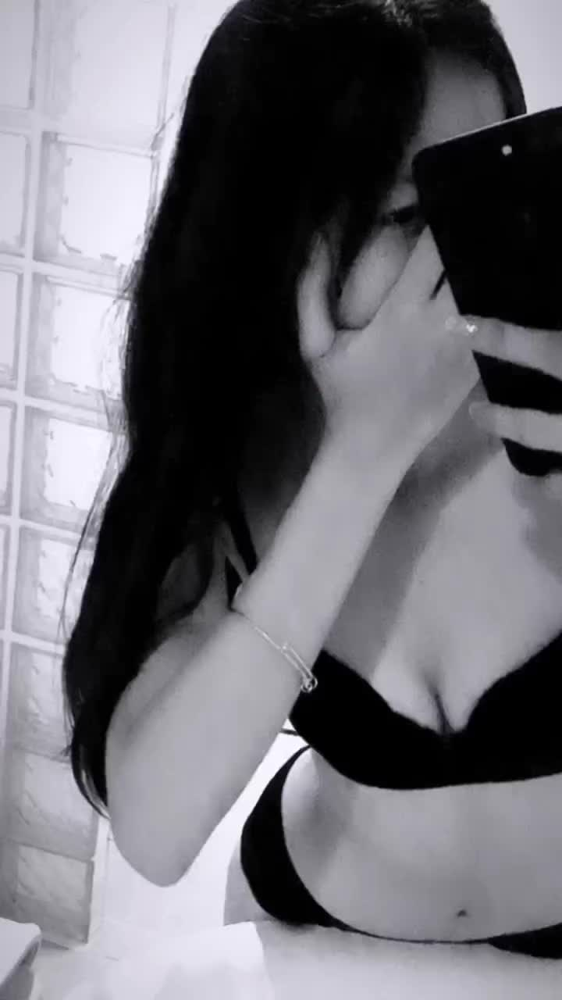

# pause-challenge

Very simple code to decode the pause challenge in Instagram. Can be modified or tweaked to be compatiable with Youtube Shorts or Tiktok (Download Part)

Example Video to try  
https://www.instagram.com/p/C1pYZaZpb43/ [SFW]
https://www.instagram.com/reel/C0X4QSwv9A3/ [NSFW]

Dependencies

ffmpeg

`brew install ffmpeg`

Steps: 
1. Download Video from source [Instagram from Now]
2. Detect changes on the Video and convert to the frames(images) take consideration of significant changes only 
3. Todo: Compare Image and Detect Nudity 
4. Currently, using a simple logic to figure out the pause challenge part 
5. Respond with the pause challenge image 

To try 

Run this project   
`go run main.go`

copy and paste it on browser  
http://localhost:8080/image?reel=https://www.instagram.com/p/C1pYZaZpb43/

Frames Detected on this Reel 

Result Image: 

